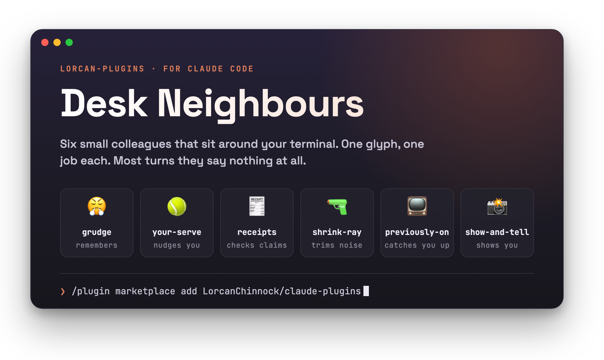
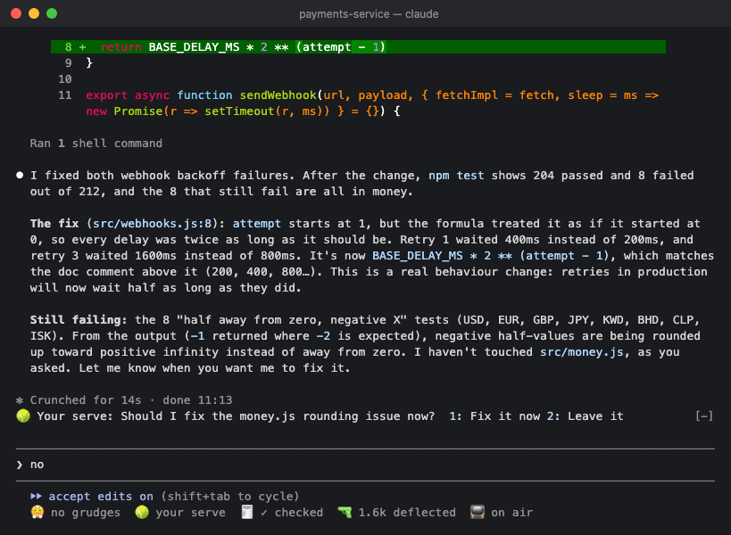
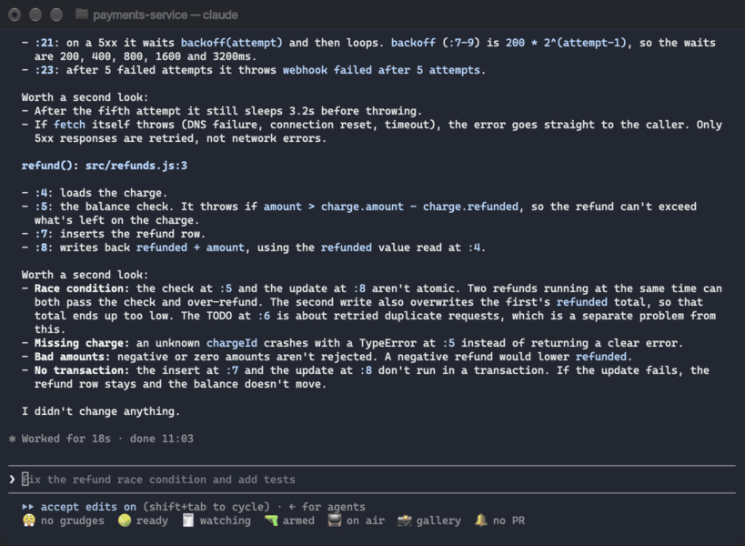
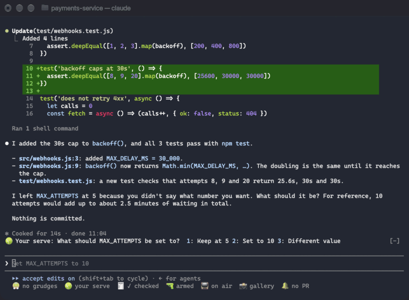
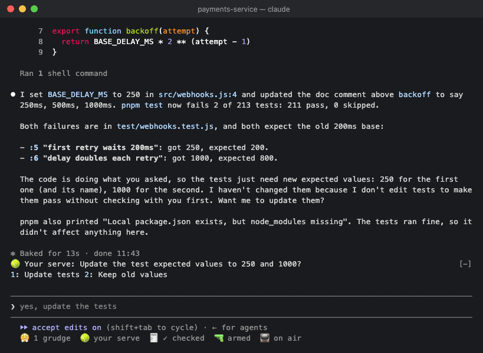
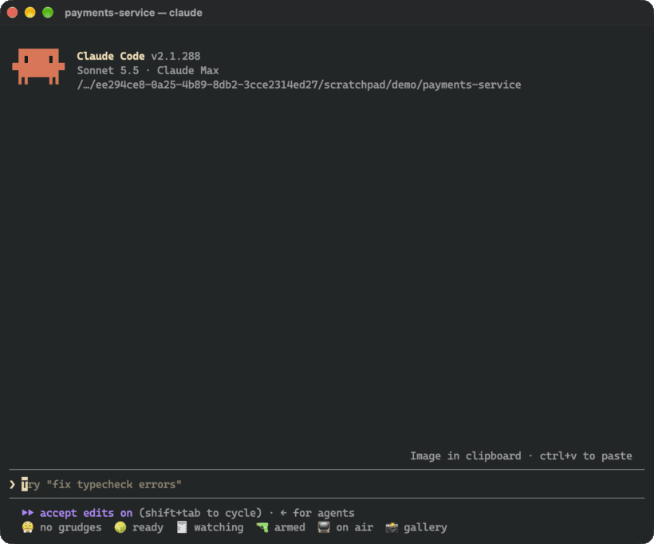

<p align="center">
  
</p>

<p align="center">
  <a href="https://github.com/LorcanChinnock/claude-plugins/actions/workflows/validate.yml"></a>
  
  <a href="LICENSE"></a>
</p>

<p align="center">
  <a href="#-grudge">😤 Grudge</a> ·
  <a href="#-your-serve">🎾 Your Serve</a> ·
  <a href="#-receipts">🧾 Receipts</a> ·
  <a href="#-shrink-ray">🔫 Shrink Ray</a> ·
  <a href="#-previously-on">📺 Previously On</a> ·
  <a href="#-show--tell">📸 Show & Tell</a>
</p>

Claude Code is great at the work and forgetful about the edges of it: the correction you made yesterday, the
question buried at the end of a long answer, the "fixed!" with nothing run, the 1,200-line log, the session you
walked away from. **Desk Neighbours** are six mods that each mind one of those edges. They live in a status row
under your prompt and speak up in one line above it, only when they have something to say.

```
/plugin marketplace add LorcanChinnock/claude-plugins
```

Then install any of them, or all six. Each works on its own, and they fit together when you have several:

```
/plugin install grudge@lorcan-plugins
/plugin install your-serve@lorcan-plugins
/plugin install receipts@lorcan-plugins
/plugin install shrink-ray@lorcan-plugins
/plugin install previously-on@lorcan-plugins
/plugin install show-and-tell@lorcan-plugins
```

---

## 😤 Grudge

**Remembers your corrections, so you only say "no, use pnpm" once.**



- **It knows a grudge from a typo.** A short prompt that reads like a correction is judged by Haiku: "use pnpm,
  not npm" is a lasting preference, "that's the wrong file" is a one-off. Only lasting ones get the offer, and
  nothing is kept unless you press Hold.
- **Held rules ride every request** in that repo, so Claude starts each session already knowing them. Personal
  style, like British spelling, is held everywhere.
- **Some grudges enforce themselves.** When a rule is an exact command swap (`npm` → `pnpm`, `python` →
  `python3`, and a few more), Grudge rewrites the command before it runs and leaves a note under the tool call:
  `😤 grudge #1: npm → pnpm`. It only swaps where the arguments mean the same thing.
- `/grudges` lists what it's holding, with how often each was enforced, and a Forgive button.

[Everything Grudge does →](plugins/grudge)

## 🎾 Your Serve

**Tells you when Claude needs you, so the question at the end of a long answer doesn't get missed.**



- **The question, pulled out.** When a turn ends by asking something, Haiku picks out the one thing you need to
  answer and up to three answers, each labelled with the choice itself ("Add 30s cap", not "Option 2").
- **Answers are buttons, not sends.** Press `1`, `2` or `3` and a natural reply lands in your prompt, ready to
  edit or send. Nothing goes to Claude until you send it.
- **It finds you if you wandered off.** If the turn took over a minute, you also get a toast, and on macOS it can
  say "Claude needs a decision" out loud.
- Statements and subagents' turns are ignored, so it only speaks up when the ball is in your court.

[Everything Your Serve does →](plugins/your-serve)

## 🧾 Receipts

**Checks claims and leftovers: "fixed" with nothing run since the last edit, and the debug lines left behind.**



- **No receipt, no credit.** If a turn edited files and then says "done", "fixed" or "tests pass" with nothing
  that checks run since the last edit, Receipts says so under the answer, and `6` fills in a prompt to run the
  check.
- **It learns your check command** per repo from the last test, typecheck, lint or build that passed, and
  remembers it across sessions.
- **Crumbs.** `console.log`, `debugger`, `.only(`, `fit(`, `binding.pry`, `dbg!` and new `TODO`s in lines Claude
  added this turn. `7` fills in a prompt to sweep them.
- **It escalates politely.** After the second missing receipt in a session it offers to make "always run the
  tests before saying done" a rule, and if Grudge is installed, Grudge offers to hold it.

[Everything Receipts does →](plugins/receipts)

## 🔫 Shrink Ray

**Shrinks what Claude reads: the 1,240-line CI log becomes the 30 lines that matter.**



- **Command output over 150 lines reaches Claude shrunk.** Colour codes and progress bars go, repeated lines
  collapse into `×37`, and passing tests drop out. Failures, every error-looking line and the exit code always
  stay, along with the beginning and the end.
- **Nothing is lost.** The full output is saved, and Claude gets its path, so it can read the rest when it needs
  to. Originals are cleaned up after seven days.
- **It keeps score.** The status row counts tokens deflected (`🔫 1.8k deflected`), and `/shrink-ray` lists each
  shrink with a button to copy its original's path.
- No model calls: it's all local text processing.

[Everything Shrink Ray does →](plugins/shrink-ray)

## 📺 Previously On

**Catches you up when you come back.**


- **"Previously on…"** Your first keystroke after 20 idle minutes brings up a short recap: what's waiting on you,
  what's done, what's pending. It's made once per return and reused if nothing has changed.
- **A morning digest.** The first session of your day shows what you worked on last time, across repos.
- **`/standup`** prints yesterday's and today's sessions, ready to paste into a standup channel.
- It keeps one short line per session, for two weeks.

[Everything Previously On does →](plugins/previously-on)

## 📸 Show & Tell

**Shows you the pictures: a thumbnail the moment you paste a screenshot, and a gallery of every image in the session.**



- **A thumbnail on paste.** Press `ctrl+v` with a screenshot on the clipboard and it appears above the prompt
  straight away, before you send. It goes when you send, or after 20 seconds.
- **Claude's pictures too.** Images Claude reads, screenshots from browser and MCP tools, and pictures it writes
  or makes with a command (`playwright screenshot`, a chart script) show up the same way.
- **`/gallery`** lists them all, newest first, with a big preview and buttons to open one, put `@path` in your
  prompt, copy its path or show it in its folder.
- Pictures draw in terminals that support the kitty graphics protocol, such as Ghostty and kitty. Other terminals,
  tmux and the desktop app show the same rows in words.

[Everything Show & Tell does →](plugins/show-and-tell)

---

## How they work together

**A status row** under the prompt, one item per installed neighbour, always in the same order. Click one, or
run its command, to open its pane; open several and they become tabs. Esc closes a pane.

```
? for shortcuts   😤 3 grudges  🎾 ready  🧾 2 unchecked  🔫 12.4k deflected  📺 on air  📸 4
```

**The band** above the prompt, only when a neighbour has something to say. One line each, Your Serve on top,
and lines wrap rather than cut anything off:


**Buttons never send anything.** They put text in your prompt for you to read, edit and send. Type a button's
digit into an empty prompt, or click it; with text already in the prompt, press `ctrl+x tab` first. Each
neighbour has its own digits, so they never clash. Show & Tell's band buttons have no digit; click them, or open
the gallery and use its letters:

| Your Serve | Grudge | Receipts | Shrink Ray | Previously On |
|---|---|---|---|---|
| `1` `2` `3` | `4` `5` | `6` `7` `8` | `9` | `0` |

Lines clear when you send your next prompt.

## Settings

Change these in `/config`, or with `/plugin configure <plugin>@lorcan-plugins`.

| Plugin | Setting | Default |
|---|---|---|
| `your-serve` | Toast when a turn that needs you took longer than (seconds) | 60 |
| `your-serve` | Also say "Claude needs a decision" out loud (macOS) | off |
| `previously-on` | Recap after this many idle minutes | 20 |
| `show-and-tell` | Keep new thumbnails above the prompt for (seconds) | 20 |

## What runs in the background

Worth knowing before you install:

- **Model calls on your account.** Grudge, Your Serve, Receipts and Previously On ask a small model (Haiku) short
  questions: is this a lasting correction, what is Claude asking, does this answer claim it's done, what was this
  session about. Each runs only after a cheap local check passes, so a typical turn makes none. Previously On's
  recap re-reads the session transcript once per return, served mostly from the prompt cache.
- **Files on disk.** Shrink Ray keeps full originals in `~/.claude/shrink-ray/` so Claude can read them if it
  needs to. Show & Tell keeps copies of pasted and tool images in `~/.claude/show-and-tell/`, and runs `cp`,
  `sips` or `magick` to copy and convert them. Both remove files older than seven days at session start (macOS and
  Linux).
- **Stored data.** Each plugin keeps a small store in your Claude Code config directory: Grudge its rules,
  Receipts each repo's check command, Shrink Ray a lifetime counter, Previously On a one-line-per-session log for
  two weeks. Uninstalling a plugin leaves its store in place.
- Nothing is sent anywhere else.

## Requirements

Desk Neighbours are mods: plugins written against Claude Code's function-hook API, which is in early access.
They are built and tested on Claude Code 2.1.288. The API can change between releases, so a newer Claude Code may
need a newer version of these plugins. If a mod seems to do nothing, `claude --debug` logs why it didn't load;
please [open an issue](https://github.com/LorcanChinnock/claude-plugins/issues) with that line.

## Updating

Third-party marketplaces don't update on their own unless you turn on auto-update in `/plugin` → Marketplaces:

```
claude plugin marketplace update lorcan-plugins
```

## Developing

Each plugin lives in `plugins/<name>/` and is listed in [`.claude-plugin/marketplace.json`](.claude-plugin/marketplace.json),
where `metadata.pluginRoot` resolves bare sources under `./plugins`.

```
claude plugin validate . --strict          # the marketplace and every plugin
claude plugin test plugins/<name>          # a mod's tests
claude --plugin-dir plugins/<name>         # try one in a session, reloading on save
```

CI runs both on every push and pull request. See [CHANGELOG.md](CHANGELOG.md) for what changed.

## License

[MIT](LICENSE)
