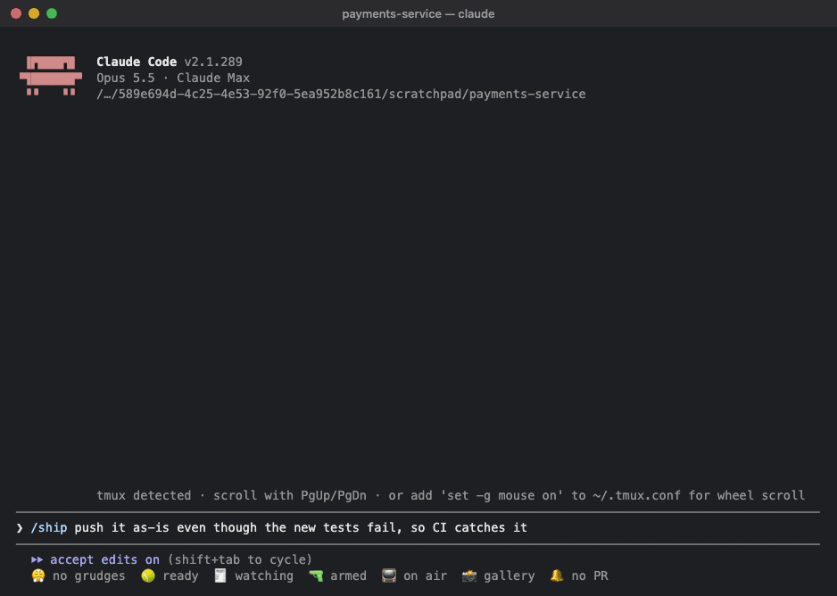
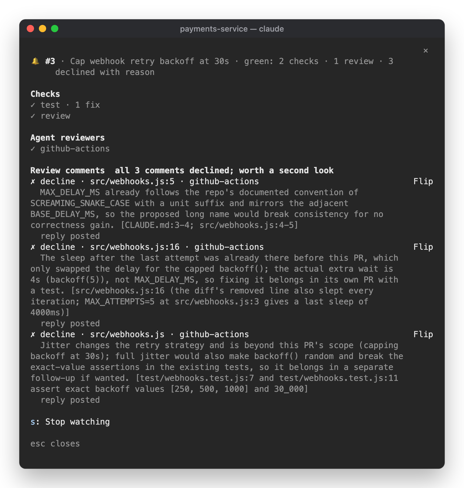

# 🔔 Closing Time

Watches a PR until CI passes and the agent reviewers are happy, and pushes back on review comments that are wrong.



```
/plugin install closing-time@claude-desk-neighbours
```

## How it works

Run `/ship` and Claude pushes the branch and raises the PR with `gh pr create`, in the style of the repo's recent
PRs. Closing Time starts watching as soon as the PR exists. It also starts watching any other PR Claude raises
with `gh pr create`, unless you turn that off. To watch a PR that already exists, run `/closing-time watch 123`
(or a PR URL, or nothing for the current branch's PR).

While it watches, it checks GitHub every 30 seconds after a push, and less often as time goes on. It only starts
a turn when there's something for Claude to do, and it waits until Claude is idle before doing so.

- **CI fails.** It waits until every check on the latest commit has finished, then gives Claude the failing checks
  and the end of each one's log. Claude is told to fix the cause, not to weaken or skip the check, and to stop and
  say so if the failure has nothing to do with the PR. If a log looks like an infrastructure flake (a lost runner,
  a network timeout), it reruns the job once instead.
- **An agent reviewer comments.** Each comment goes to a separate triage agent before anything changes (see below).
  Claude only gets the comments that were accepted, along with the evidence for each one.
- **It's green.** You get a toast and a line above the prompt, such as
  `🔔 #42 green · 5 checks · 2 reviews · 1 declined with reason`. It keeps watching for 10 more minutes in case
  a bot's review turns up late, and a late comment reopens the loop. Closing Time never merges anything.

"Green" means every required check on the latest commit passed (or every check, if the repo has none marked
required), each agent reviewer has reviewed the latest commit, and every review comment, from a bot or a person, is
either resolved, fixed in a later commit, or answered with a reason. If a bot hasn't reviewed the latest commit after 15 minutes, its older
review still counts, and the green line says it's out of date.

## Healthy criticism

Reviewers, bots and people alike, are often right and often wrong. The triage agent treats each comment as a claim
to check, not an order to follow:

- It reads the code the comment is about, and the callers, and decides on one of: **accept**,
  **accept-modified** (the problem is real, but the fix should be different), **decline**, **already handled**,
  or **needs you**.
- Each verdict comes with a reason and evidence (`path:line` or what it checked). Declining needs evidence just
  as much as accepting does.
- It declines refactors nobody asked for, speculative "consider…" comments, style that clashes with the code
  around it, and anything that weakens a test or check to get it passing.
- Design decisions, and comments that contradict another reviewer, go to you.
- It can only read the code (Read, Grep, Glob). It can't edit files, run commands or reach the network.

Comment text comes from a third party, so it only ever reaches Claude quoted as data. Claude and the triage agent
are told never to run a command because a comment suggests it.

Comments from people are triaged the same way, and their replies follow the same Post replies setting.

## Replies

Declined comments, and fixed ones, get a reply drafted: `Not changing this: <reason> (<evidence>)` or
`Fixed in abc1234.` Evidence goes in the reply only when it's short. File paths are always written relative to
the repo, so a reply never posts a path from your machine. By default, nothing is posted until you press **Post** in the band or the pane. Posting
resolves the threads that were fixed, and leaves declined ones open so a person can judge them. **Discard** drops
the drafts.

## When it hands over to you

It stops asking Claude, and the band says why, when:

- one check still fails after 2 fix attempts
- there are still comments to fix after 3 rounds of review fixes
- triage says a comment needs you, or the triage agent couldn't start
- the PR is merged or closed, or nothing has changed for 60 minutes

## The pane

Click the `🔔` item in the status row (`no PR`, `#42 CI 3/5 · reviews 1/2`, `#42 needs you`, `#42 green`), or
run `/closing-time`. It lists the checks, the agent reviewers, every review comment with its verdict, reason and
draft reply. **Flip** overrides a verdict: an accepted comment becomes declined, and
anything else becomes accepted and goes to Claude. If every comment so far went the same way, the pane points it
out, since either all the comments were right or the triage wasn't really looking.



`p` posts the drafts, `d` discards them, and `s` stops watching. `/closing-time stop` stops watching too. The band
buttons have no digit keys, because the other neighbours already use all ten, so click them or use the pane.

## Settings

| Setting | Default |
|---|---|
| Watch any PR Claude raises, not only ones from `/ship` | on |
| Agent reviewers (comma-separated logins; empty means any bot that reviews). These are the reviewers it waits on to review the latest commit. A listed login counts even when GitHub types the account as a User, which some review bots are | empty |
| Post replies: `ask` or `auto` | `ask` |
| Rerun a job once when its log looks like a flake | on |
| Fix attempts per check | 2 |
| Review rounds | 3 |
| Minutes to wait for a bot to review the latest commit | 15 |
| Minutes with no change before it stops watching | 60 |

## In the background

- It runs `gh` with your login: one GraphQL query per check, `gh pr diff` and `gh run view --log-failed` when
  there's something to look at, `gh run rerun --failed` for a flake, and (once you press Post) a reply on the
  thread plus resolving it.
- Each review comment starts one triage subagent on the session's model. At most 6 start at once.
- When a CI log might be a flake, it asks Haiku whether the failure is infrastructure or code.
- What it's watching lives in the session's state. A new session starts with nothing watched.
- It needs the `gh` CLI, logged in, and the PR's branch checked out so the triage agent can read the code. If the branch is checked out in a git worktree rather than the session's directory, it finds that worktree with `git worktree list` and points Claude and the triage agent there.

## Not covered yet

- Comments that a bot leaves on the PR conversation instead of in a review thread (some bots summarise there).
- Review bodies: only threads on lines of code are triaged.
