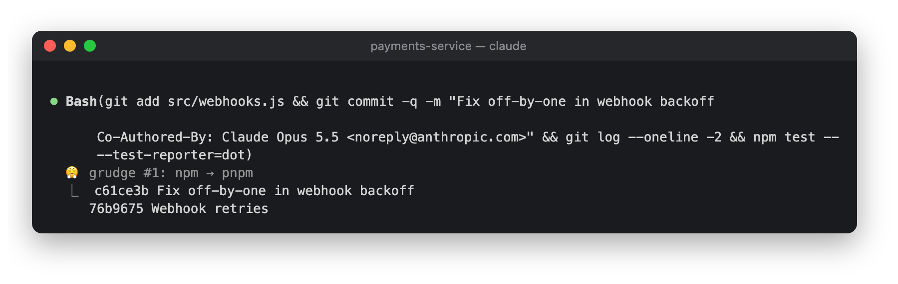
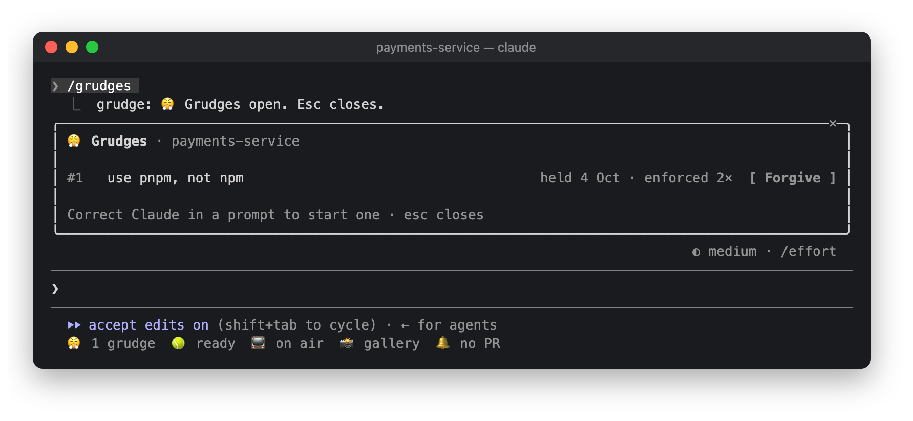

# 😤 Grudge

Remembers your corrections, so you only say "no, use pnpm" once.


```
/plugin install grudge@lorcan-plugins
```

## How it works

- **The offer.** When you send a short prompt that reads like a lasting preference ("no, use pnpm",
  "don't use default exports", "always use the logger, not console"), the band offers, while Claude works:

  ```
  😤 Hold a grudge? "use pnpm, not npm"                      4: Hold  5: Nah
  ```

  Nothing is remembered unless you press Hold: type `4` into an empty prompt, or click it. One-off fixes
  ("that's the wrong file") don't get an offer. An ignored offer fades when you send your next prompt.
- **Standing preferences.** Every held rule is given to Claude in every session in that repo. Rules about
  personal style (spelling, tone) are held everywhere.
- **Fixed commands.** Where a rule is an exact command swap, Grudge fixes the command before it runs and notes it
  under the tool call: `😤 grudge #4: npm → pnpm`. Swaps are whole commands only (never `.npmrc`) and only
  where the arguments mean the same thing:

  | From | To | After |
  |---|---|---|
  | `npm` | `pnpm` | `install`, `i`, `run`, `test`, `start` |
  | `npm` | `yarn` | `run`, `test`, `start` |
  | `npm` | `bun` | `install`, `i`, `run` |
  | `pnpm` | `npm` | `install`, `i`, `run`, `test`, `start` |
  | `yarn` | `npm` | `run`, `test`, `start` |
  | `yarn` | `pnpm` | `install`, `run`, `test`, `start` |
  | `pip` | `pip3` | anything |
  | `python` | `python3` | anything |

  Asked to run `npm test` anyway, the command ran as `pnpm test`:

  

## The pane

Click `😤 1 grudge` in the status row, or run `/grudges`. Rules held for this repo come first, then those held
everywhere:



Forgiving a rule removes it at once.

## In the background

A prompt under 400 characters that contains a correction marker is sent to Haiku to judge whether it's a lasting
preference. Other prompts cost nothing. Rules are kept in the plugin's store.
