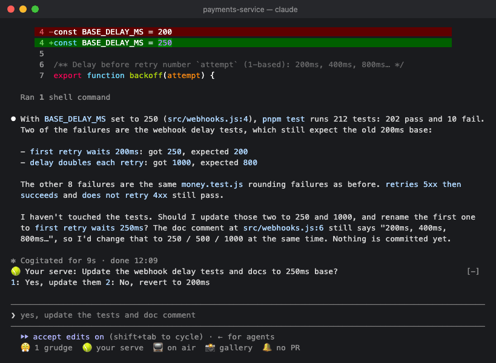
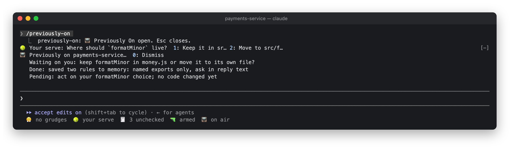
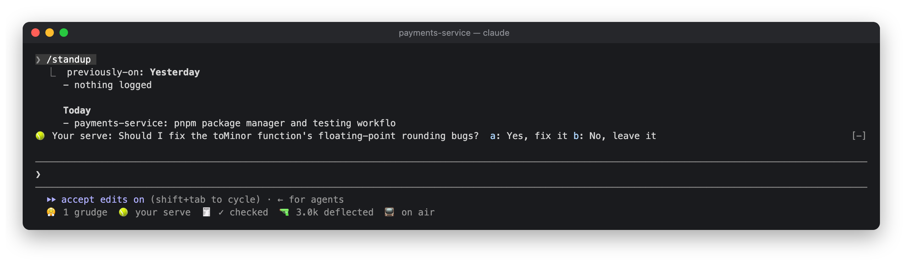
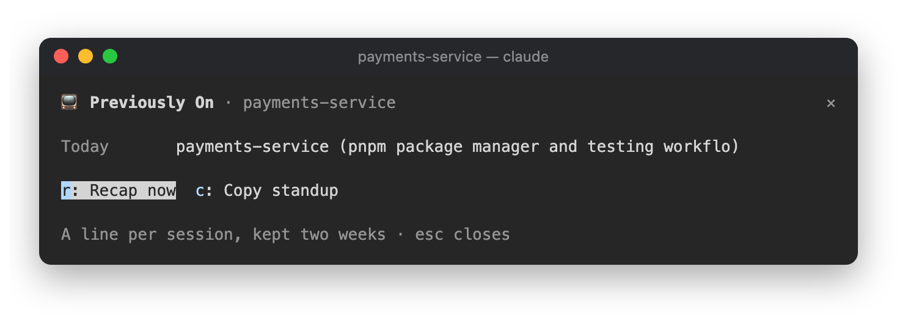

# 📺 Previously On

Catches you up when you come back.



```
/plugin install previously-on@claude-desk-neighbours
```

## How it works

If you've been idle for 20 minutes in a session that has some finished turns, your first keystroke brings up a
recap:

```
📺 Previously on payments-service…
   Waiting on you: keep or drop the old cache?
   Done: retry logic for webhook sends, tests green
   Pending: idempotency key on refunds
```

It's only generated once each time you come back, and reused if nothing has changed. It goes away when you send a
prompt or press Dismiss (`0` in an empty prompt, or click it). Here's the recap from the demo above, sitting under
a Your Serve question:



The first session of your day also shows a one-off digest of the previous day's sessions:

```
📺 Yesterday: payments-service (webhook retries) · web-app (login copy fixes)
```

And `/standup` prints the previous day's and today's sessions so you can paste them into your standup channel.



## The pane

Click `📺 on air` in the status row, or run `/previously-on`, to see today's and the previous day's sessions.
There are buttons for **Recap now** (`r`) and **Copy standup** (`c`).



## Settings

| Setting | Default |
|---|---|
| Recap after this many idle minutes | 20 |

## In the background

The recap re-reads the session transcript in one model call, which mostly comes out of the prompt cache. After
the first turn, and then every fifth turn, Haiku looks at your prompts and gives the session a topic for the day
log. The log has one line per session and is kept for two weeks in the plugin's store.
