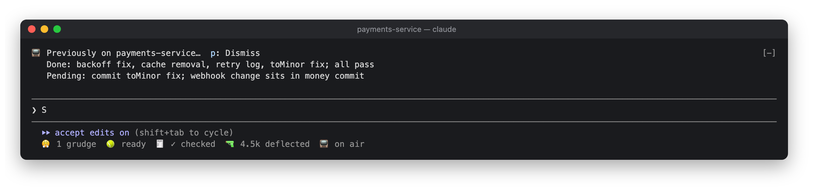

# 📺 Previously On

Catches you up when you come back.

```
/plugin install previously-on@lorcan-plugins
```

## How it works

- **Return recap.** Your first keystroke after 20 idle minutes, in a session with finished turns, brings up:

  ```
  📺 Previously on payments-service…
     Waiting on you: keep or drop the old cache?
     Done: retry logic for webhook sends, tests green
     Pending: idempotency key on refunds
  ```

  It's made once per return and reused if nothing has changed. It clears when you send a prompt, or press
  Dismiss: `0` in an empty prompt, or a click. Typing one key after 20 minutes away:

  

  The same recap on demand (**Recap now** in the pane), here while a Your Serve question was waiting:

  
- **Morning digest.** The first session of your day shows the last day's sessions, once:

  ```
  📺 Yesterday: payments-service (webhook retries) · web-app (login copy fixes)
  ```

- **`/standup`** prints the last day's and today's sessions, ready to paste into a standup channel.

  

## The pane

Click `📺 on air` in the status row, or run `/previously-on`: today's and the last day's sessions, **Recap now**
(`r`) and **Copy standup** (`c`).


## Settings

| Setting | Default |
|---|---|
| Recap after this many idle minutes | 20 |

## In the background

The recap re-reads the session transcript with one model call, mostly served from the prompt cache. After the
first turn and every fifth, Haiku names the session's topic from your prompts for the day log. The log is one
line per session, kept for two weeks in the plugin's store.
