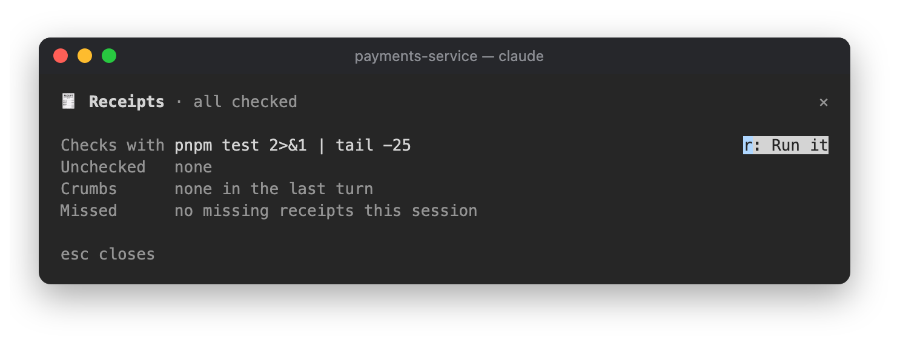

# 🧾 Receipts

Checks claims and leftovers: "fixed" with nothing run since the last edit, and the debug lines left behind.


```
/plugin install receipts@lorcan-plugins
```

## How it works

Receipts watches every file edit and every shell command. It learns each repo's check command (tests,
typecheck, lint or build) from the last one that passed, and remembers it across sessions.

- **No receipt.** If a turn edited files and then claims success ("fixed", "tests pass", "done") but nothing that
  checks ran after the last edit, a line appears under the answer:

  ```
  🧾 No receipt: nothing ran since edit to src/auth.ts
  ```

- **Crumbs.** Leftovers in lines Claude added this turn: `console.log`, `debugger`, `print(` outside tests,
  `.only(`, `fit(`, `fdescribe(`, `binding.pry`, `dbg!`, and new `TODO`/`FIXME`s.

  ```
  🧾 No receipt: nothing ran since edit to src/auth.ts · 2 crumbs (console.log api.ts:41, .only auth.test.ts:12)
  ```

  In the demo above Claude was asked not to run anything and said so plainly, so there's no "No receipt",
  only the crumb.

The band offers what to do next. Each button fills your prompt; nothing is sent until you send it. Type its
digit into an empty prompt, or click it:

| Key | Button | Fills |
|---|---|---|
| `6` | Run them | Run `` `pnpm test` `` and show me the result. |
| `7` | Sweep | Remove these leftovers: console.log in src/api.ts:41, … |
| `8` | Make it a rule | From now on, always run `` `pnpm test` `` before saying something is done. |

"Make it a rule" appears after the second missing receipt in a session. If Grudge is installed, it will offer to
hold that rule.

A turn that checked its work and left no crumbs shows nothing.

## The pane

Click the `🧾` item in the status row (`watching`, `2 unchecked`, `✓ checked`), or run `/receipts`: the check
command, which files are unchecked, the last turn's crumbs, and missed receipts this session.



## In the background

Only when a turn edited files, used success words and ran no check since its last edit does Receipts ask Haiku
whether the answer really claims to be done. That call is capped at 2.5 seconds. Each repo's check command is
kept in the plugin's store.
