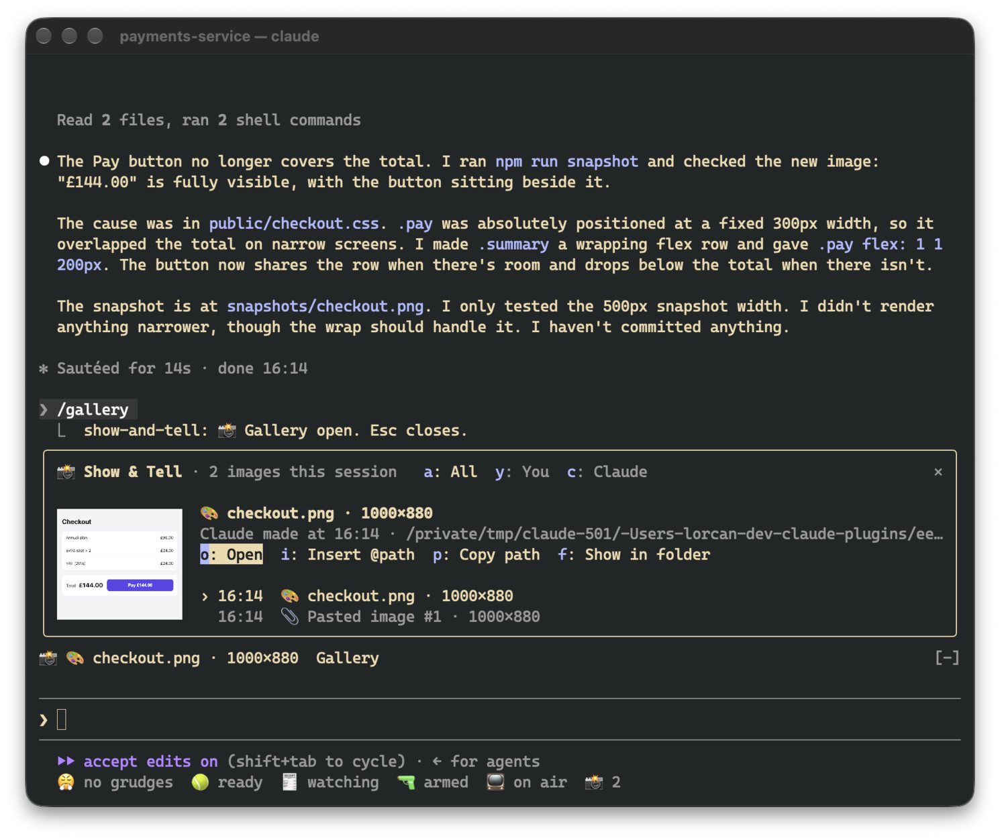

# 📸 Show & Tell

Shows a thumbnail as soon as you paste a screenshot, and keeps a gallery of every image in the session.


```
/plugin install show-and-tell@claude-desk-neighbours
```

## How it works

Hit `ctrl+v` with an image on your clipboard and a thumbnail appears above the prompt within about a quarter of a
second, before you've sent anything. Show & Tell watches your draft for Claude Code's `[Image #1]` and copies the
image Claude Code saved for it. If that file isn't where it expects, it reads the clipboard itself (`osascript`
on macOS, `wl-paste` or `xclip` on Linux, PowerShell on Windows). If that doesn't work either, it grabs the image
when you send the prompt.

Claude's pictures get picked up the same way. That covers images Claude opens with Read, screenshots returned by
browser or MCP tools, pictures Claude writes or edits, and images a shell command creates in the working
directory or one level down (`playwright screenshot`, a chart script).

The band above the prompt shows the newest thumbnails, with Gallery and Dismiss buttons. A pasted thumbnail goes
away when you send it. Everything else disappears after 20 seconds, which you can change in `/config`.

## The gallery

Click `📸 4` in the status row, or run `/gallery`, to see every image from this session, newest first, with a big
preview of whichever one you select. `a`, `y` and `c` filter to all images, yours, or Claude's. `o` opens the
image in your viewer, `i` puts `@path` in your prompt so Claude can look at it again, `p` copies the path, and
`f` shows it in its folder. Tab moves through the list. This is after Claude fixed the checkout and took a
snapshot:



The gallery asks for enough room to show a picture. If it doesn't get it (say, an inline pane in a small
terminal), the picture shrinks to fit and the footer is hidden so the header, actions and list stay visible.

## Which terminals show pictures

Pictures only render in terminals that support the kitty graphics protocol, which means Ghostty and kitty. In
other terminals, in tmux and in the desktop app, the band and gallery show the same thing as text
(`📎 Pasted image #1 · 200×120`), and all the buttons still work.

Thumbnails have to be PNGs, so other formats get converted once: with `sips` on macOS and ImageMagick (`magick` or
`convert`) elsewhere. On macOS, `qlmanage` handles SVG and PDF. If there's no converter, the image is still
listed, just without a picture.

## In the background

There are no model calls. Pasted images, and images that only exist inside a tool's result, are copied to
`~/.claude/show-and-tell/<session>/` next to a `manifest.json` that restores the gallery after `/resume`. Files
Claude read or created stay where they are. Copies older than seven days are deleted when a session starts. The
cleanup uses `find`, so on Windows they stick around until you delete them yourself.

While a session is open, the draft is checked four times a second. That's just a read of the prompt box, and
nothing runs unless a new `[Image #N]` shows up. Where Claude Code saves pastes (`/tmp/claude-<uid>/…/images/`)
isn't part of the plugin API, so a future version of Claude Code might move it. If that happens, Show & Tell
falls back to reading the clipboard.
