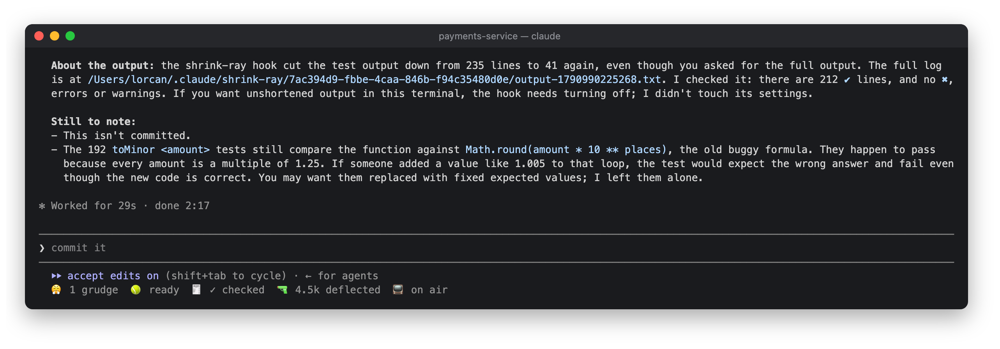

# 🔫 Shrink Ray

Shrinks what Claude reads: the 1,240-line CI log becomes the 30 lines that matter.

```
/plugin install shrink-ray@lorcan-plugins
```

## How it works

- **Pastes over 80 lines** shrink as they land. Repeated lines collapse into `×37`, timestamps go, framework
  and dependency stack frames fold (the first and last frames stay), and big JSON becomes its shape and a few
  items. The band shows `🔫 Shrunk 1,240 → 31 lines` with `9: Undo` for ten seconds; undo restores the
  exact paste.
- **Command output over 150 lines** reaches Claude shrunk. Colour codes and progress bars go, repeats
  collapse, passing tests drop out while failures and the summary stay, and the beginning and end are kept.
  Every error-looking line and the exit code always stay. The output starts with
  `[shrink-ray: 1,240 → 60 lines, full output: <path>]`.

Claude sees the path to every original and can read it whenever it needs the rest. Other tools and plugins
still see the full command result. After a 212-test run, Claude checked the original rather than trust the
shortened output:



## The pane

Click `🔫 12.4k deflected` in the status row, or run `/shrink-ray`: tokens saved this session and in total,
and each shrink with a button to copy its original's path. After one 212-test run with 8 failures:


## In the background

No model calls. Originals are kept in `~/.claude/shrink-ray/<session>/`. Files older than seven days are removed
when a session starts. That needs `find`, so on Windows the originals stay until you delete them.
