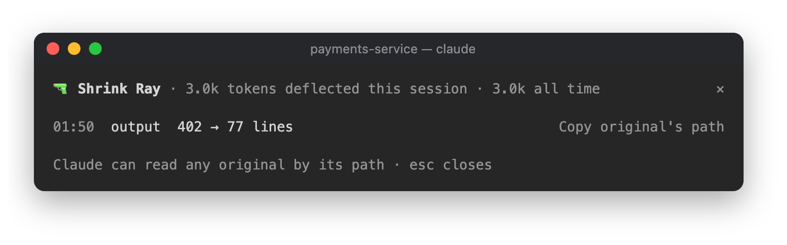

# 🔫 Shrink Ray

Cuts a 1,240-line CI log down to the 30 lines Claude actually needs.


```
/plugin install shrink-ray@claude-desk-neighbours
```

## How it works

Pastes over 80 lines get shrunk as they land. Repeated lines collapse into `×37`, timestamps are removed, stack
frames from frameworks and dependencies are folded (keeping the first and last), and big JSON is reduced to its
shape plus a few items. The band shows `🔫 Shrunk 1,240 → 31 lines` with `9: Undo` for ten seconds, and undo
puts back exactly what you pasted. This doesn't work yet on Claude Code 2.1.288, though. A long paste arrives in
the prompt as a `[Pasted text #1 +200 lines]` placeholder, and Shrink Ray never sees the text.

Command output over 150 lines is shrunk before it reaches Claude. Colour codes and progress bars are stripped,
repeats collapse, and passing tests are dropped while failures and the summary stay, along with the start and
end of the output. Anything that looks like an error is always kept, and so is the exit code. The shrunk output
starts with `[shrink-ray: 1,240 → 60 lines, full output: <path>]`.

Claude is given the path to every original and can read it whenever it needs the rest. The originals are stored
outside your project, so the first time Claude reads one in a session it'll ask your permission. Other tools and
plugins still get the full command output.

A lot of the time Claude trims output itself (`pnpm test 2>&1 | tail -50`). Then nothing goes over 150 lines and
Shrink Ray doesn't need to do anything.

## The pane

Click `🔫 12.4k deflected` in the status row, or run `/shrink-ray`, to see how many tokens have been saved this
session and overall, plus every shrink with a button to copy the original's path. Here it is after one 212-test
run with 8 failures:



## In the background

There are no model calls. Originals are kept in `~/.claude/shrink-ray/<session>/`, and anything older than seven
days is deleted when a session starts. The cleanup uses `find`, so on Windows the originals stick around until
you delete them yourself.
