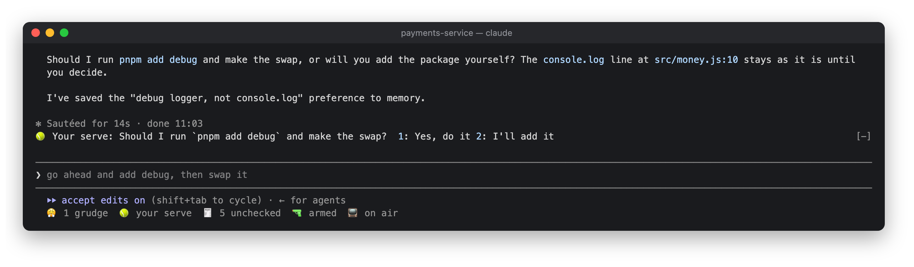
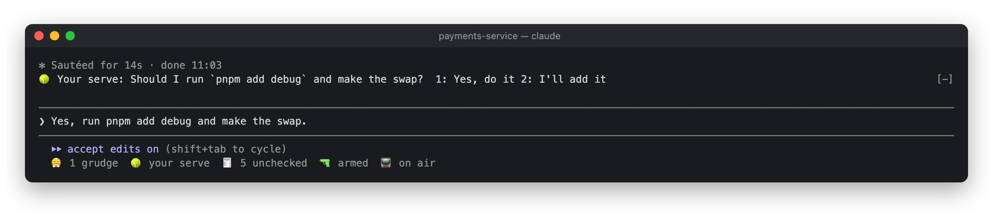

# 🎾 Your Serve

Tells you when Claude needs you, so the question at the end of a long answer doesn't get missed.

```
/plugin install your-serve@lorcan-plugins
```

## How it works

When a turn ends with a question, a choice between options, or "should I also…", the band's top line says so:

```
🎾 Your serve: Keep the old cache or drop it?          1: Keep  2: Drop  3: Something else
```



Pressing an answer puts a natural reply in your prompt ("Drop the old cache.") for you to send. Type its
digit into an empty prompt, or click it. With no clear options, the line shows just the question. It stays until
you send a prompt. Answers that are statements produce nothing, and subagents' turns are ignored.



Your Serve reads the text of Claude's answer, so a question Claude asks with its own question picker doesn't
show here. The picker is already in front of you.

If the turn took longer than a minute, a toast says `🎾 Claude needs a decision` too, in case you'd wandered off.

## The pane

Click `🎾 ready` in the status row, or run `/your-serve`: the question waiting on you with its answers, and the
questions Claude asked earlier this session.


## Settings

| Setting | Default |
|---|---|
| Toast when a turn that needs you took longer than (seconds) | 60 |
| Also say it out loud (macOS) | off |

## In the background

Only answers whose ending has a question mark, an options list or asking phrasing are sent to Haiku, which picks out
the question and up to three answers.
